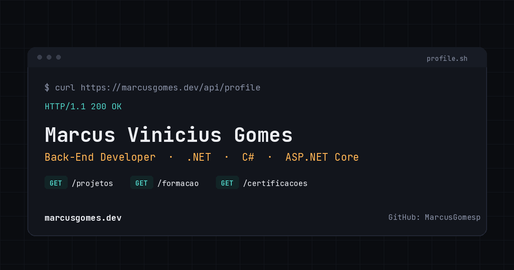

# marcusgomes.dev

Portfólio pessoal de **Marcus Vinicius Gomes** — Desenvolvedor Back-End focado no ecossistema .NET.

🔗 **Site publicado:** [marcusgomes.dev](https://marcusgomes.dev)



## Sobre o projeto

Site estático, single-page, com um conceito visual central: a página se comporta como uma **API respondendo** — o hero simula uma resposta `GET /api/profile` em JSON digitada em tempo real, a navegação usa rotas HTTP (`GET /sobre`, `GET /projetos`...), cada projeto é exibido como um endpoint (método + rota + status) e a formação acadêmica é apresentada como um changelog de versões.

## Tecnologias

- **HTML5** semântico
- **CSS3** puro (sem framework), com variáveis CSS para o design system
- **JavaScript** vanilla (sem dependências), organizado em módulo isolado (IIFE)
- Fontes: [Space Grotesk](https://fonts.google.com/specimen/Space+Grotesk), [Inter](https://fonts.google.com/specimen/Inter) e [JetBrains Mono](https://fonts.google.com/specimen/JetBrains+Mono)
- Ícones: [Font Awesome](https://fontawesome.com/)
- Hospedagem: [Netlify](https://www.netlify.com/)

## Funcionalidades

- 🌐 Alternância de idioma PT-BR / EN, sem reload da página
- ⌨️ Efeito de "digitação" no hero, respeitando `prefers-reduced-motion`
- 📱 Totalmente responsivo, com menu mobile próprio
- ♿ Cuidados de acessibilidade: skip-link, foco visível no teclado, `aria-label`s nos elementos interativos
- 🔒 Boas práticas de segurança: Content-Security-Policy, `rel="noopener noreferrer"` em links externos, e-mail de contato montado via JS para dificultar raspagem automática

## Estrutura

```
├── index.html      # marcação e conteúdo
├── style.css        # estilos e design tokens (variáveis CSS)
├── script.js         # idioma, preloader, scroll reveal, menu mobile
├── favicon.svg       # ícone da aba do navegador
├── og-image.png       # imagem exibida ao compartilhar o link (Open Graph)
└── imagem/            # imagens auxiliares
```

## Rodando localmente

Como é um site 100% estático, não há build nem dependências para instalar. Basta:

```bash
git clone https://github.com/MarcusGomesp/<nome-do-repositorio>.git
cd <nome-do-repositorio>
```

E abrir o `index.html` no navegador — ou, para simular melhor o ambiente de produção, servir com qualquer servidor estático:

```bash
npx serve .
```

## Contato

- LinkedIn: [Marcus Vinicius Gomes](https://www.linkedin.com/in/marcus-vinicius-gomes-226552249/)
- GitHub: [@MarcusGomesp](https://github.com/MarcusGomesp)
